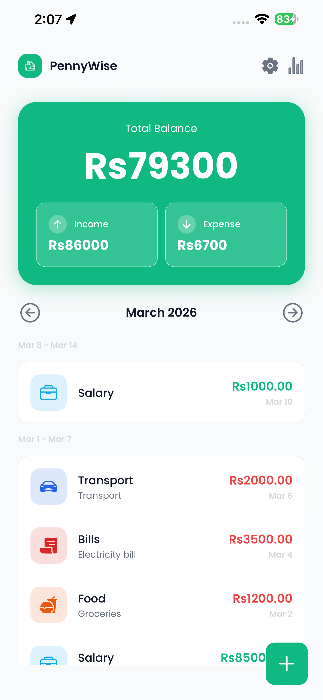
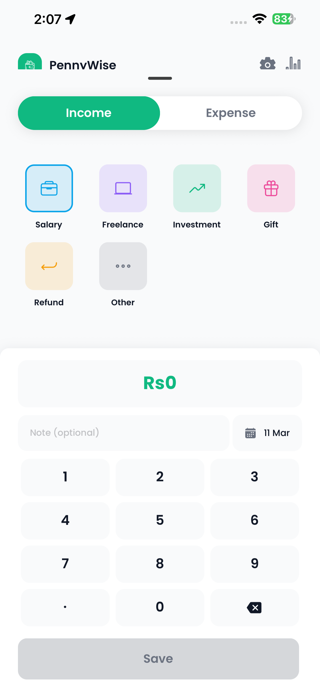
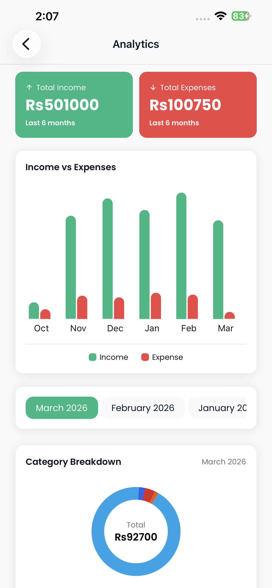
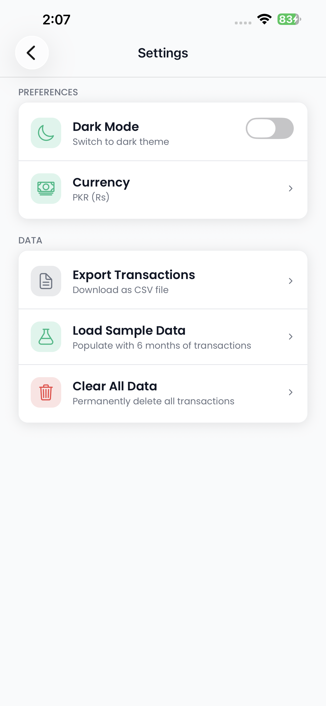
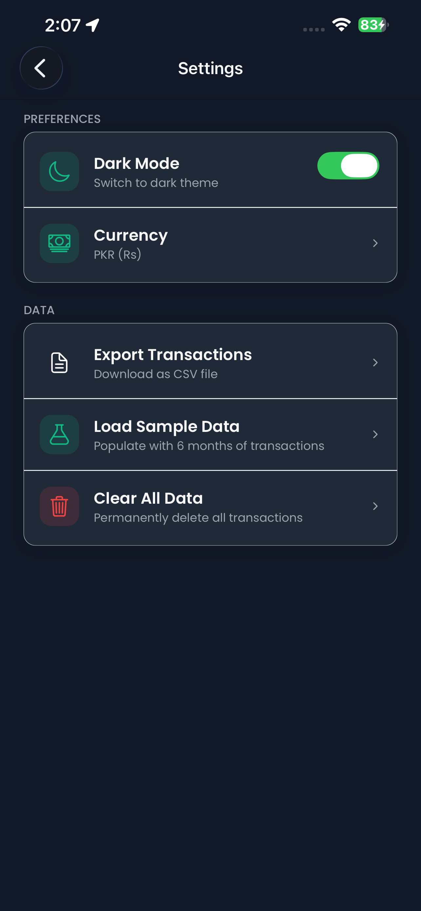

<h1 align="center">
  <br/>
  PennyWise
</h1>

<p align="center">
  A personal finance tracker built with React Native & Expo
</p>

<p align="center">
  
  
  
  
  
</p>

<br/>

## Screenshots

<table>
  <tr>
    <td align="center"><b>Home</b></td>
    <td align="center"><b>Add Transaction</b></td>
    <td align="center"><b>Analytics</b></td>
  </tr>
  <tr>
    <td></td>
    <td></td>
    <td></td>
  </tr>
  <tr>
    <td align="center"><b>Settings (Light)</b></td>
    <td align="center"><b>Settings (Dark)</b></td>
    <td></td>
  </tr>
  <tr>
    <td></td>
    <td></td>
    <td></td>
  </tr>
</table>

<br/>

## Features

- **Transaction tracking** — Add, edit, and delete income & expense entries with category, note, and custom date
- **Monthly view** — Browse transactions by month with weekly groupings and a balance summary card
- **Analytics** — Income vs Expenses bar chart, category breakdown donut chart, and 6-month totals
- **Dark mode** — Full light/dark theme with persistent preference
- **Multi-currency** — Switch between PKR, USD, and GBP; symbol updates throughout the app instantly
- **CSV export** — Export all transactions as a `.csv` file via the native share sheet
- **Offline-first** — All data stored locally on device using SQLite; no account or internet required

<br/>

## Tech Stack

| Layer | Technology |
|---|---|
| Framework | React Native 0.81 + Expo 54 (New Architecture) |
| Language | TypeScript 5.9 |
| Navigation | Expo Router (file-based) |
| Database | expo-sqlite |
| Preferences | react-native-mmkv |
| State | Zustand |
| Animations | react-native-reanimated |
| Charts | react-native-gifted-charts |
| Bottom Sheet | @gorhom/bottom-sheet |
| Font | Poppins (@expo-google-fonts) |

<br/>

## Architecture

```
app/                  # Expo Router screens
components/
  base/               # Generic building blocks (ThemedView, Spacer, FAB)
  shared/             # Feature-level components (TransactionItem, SpendingChart, …)
  ui/                 # Reusable UI primitives (Button, NumPad, BottomSheet, …)
constants/            # Colors, Typography, Spacing, Currencies
context/              # PrefsContext — theme + currency provided to the entire tree
hooks/                # useTransactions, useAnalytics, usePrefs
services/             # transactionService, prefsService, seedService
stores/               # Zustand slices (transactionStore, analyticsStore, prefsStore)
models/               # TypeScript interfaces (Transaction, Summary, Category)
utils/                # formatUtils, exportUtils
```

**Key patterns:**
- `createStyles(theme)` + `useMemo` for dynamic themed `StyleSheet`s — zero re-renders on theme switch
- Services layer isolates all SQLite queries from UI
- Zustand stores hold derived state; hooks own async logic and orchestrate store updates
- `PrefsContext` wraps the app once; every component reads theme/currency via `useAppPrefs()`

<br/>

## Getting Started

**Prerequisites:** Node 18+, Expo CLI, Android emulator or physical device

```bash
# Clone
git clone https://github.com/zeeshanahmad0201/penny_wise_rn.git
cd penny_wise_rn

# Install dependencies
npm install

# Start (Expo Go will NOT work — app uses native modules)
npx expo run:android
```

> **Why not Expo Go?** PennyWise uses `react-native-mmkv` which requires a native build. Run `npx expo run:android` or build with EAS (see below).

### EAS Build (Android APK)

```bash
npm install -g eas-cli
eas login
eas build -p android --profile preview
```

The build produces a shareable APK link on [expo.dev](https://expo.dev).

> **Try it:** [Download APK](https://github.com/zeeshanahmad0201/penny_wise_rn/releases/tag/v1.0.0)

<br/>

## Built By

**Zeeshan Ahmad** — Flutter developer with 5+ years experience, rebuilt this app in React Native to prove cross-framework skills. Originally shipped in Flutter on the Play Store.

[](https://github.com/zeeshanahmad0201)
[](https://linkedin.com/in/xeeshan-ahmad)
